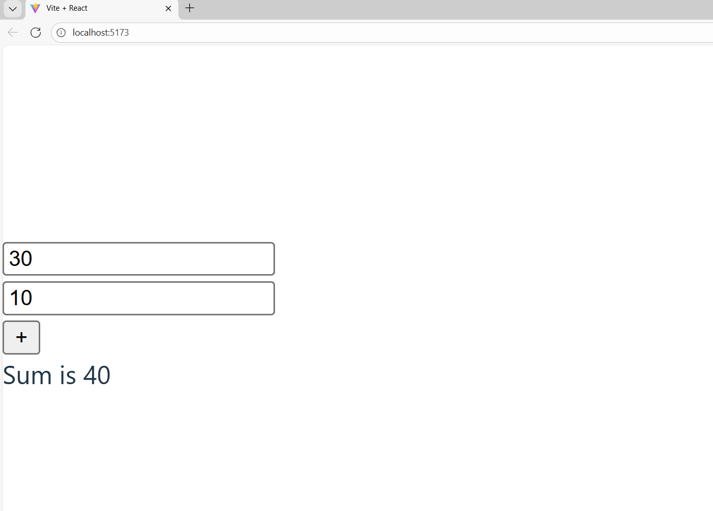

# Sum Calculator - React + Vite

[](https://reactjs.org/)
[](https://vitejs.dev/)
[](https://eslint.org/)
[](https://opensource.org/licenses/MIT)

A simple, interactive React application built with Vite that demonstrates a basic sum calculator component with real-time input validation. Perfect for learning React class components, state management, and modern web development workflows.

## Features

- **Sum Calculator Component**: Enter two numbers and instantly calculate their sum.
- **Input Validation**: Real-time validation ensures only numeric inputs; displays helpful error messages.
- **React Class Component**: Showcases traditional class-based React with state and lifecycle methods.
- **Vite Dev Server**: Ultra-fast development with Hot Module Replacement (HMR) for instant updates.
- **ESLint Integration**: Configured for code quality and consistency.
- **Responsive Design**: Works seamlessly across devices.

## Quick Start

### Prerequisites

- **Node.js** 18+ (download from [nodejs.org](https://nodejs.org/))
- **npm** (comes bundled with Node.js)

### Installation

1. **Clone or Download** the repository:
   ```bash
   git clone https://github.com/yourusername/react-sum-calculator.git
   cd react-sum-calculator
   ```

2. **Install Dependencies**:
   ```bash
   npm install
   ```

3. **Start Development Server**:
   ```bash
   npm run dev
   ```

4. **Open in Browser**:
   - Navigate to `http://localhost:5173` (or the URL displayed in your terminal)
   - Start calculating sums!


### Example
- Input: 5 and 3
- Output: "Sum is 8"



## Usage

The Sum Calculator component is simple to use:

1. Enter the first number in the input field
2. Enter the second number in the input field
3. Click the "Calculate" button or press Enter
4. View the result displayed below

**Note**: The calculator only accepts numeric values. Non-numeric inputs will trigger a validation error message.


##  Project Structure

```
REACT-PROJECT/
├── public/
│   └── vite.svg
├── src/
│   ├── assets/
│   │   └── react.svg
│   ├── App.css
│   ├── App.jsx          # Default Vite component (not rendered)
│   ├── index.css
│   ├── main.jsx         # App entry point
│   └── Sum.jsx          # Main calculator component
├── index.html
├── package.json
├── vite.config.js
├── eslint.config.js
└── README.md
```

